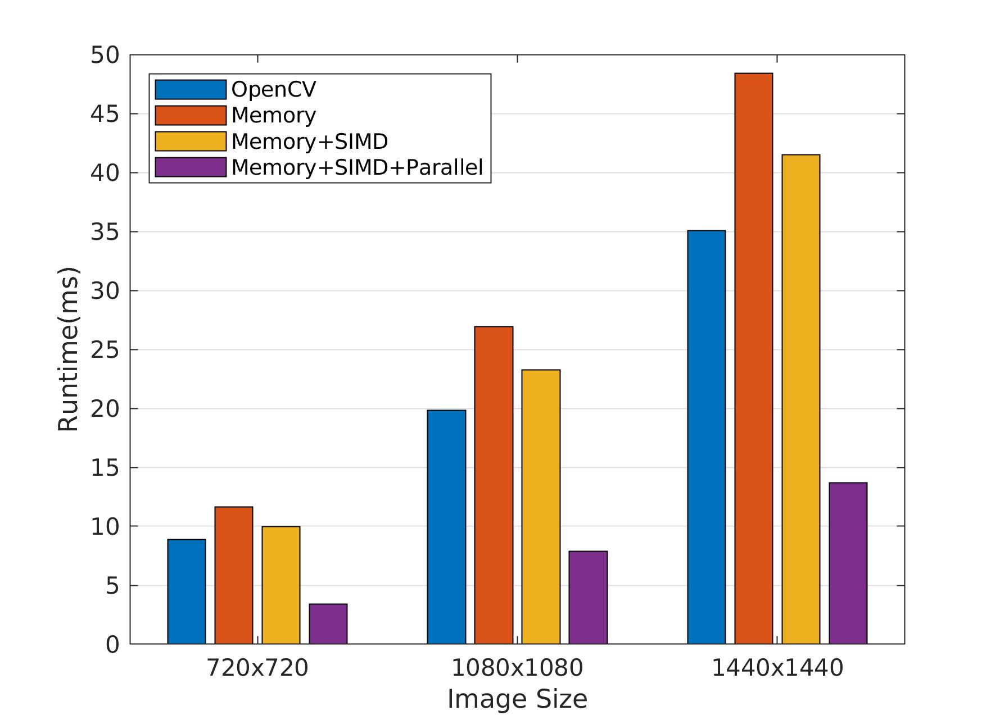

# Fast Gaussian Blur
Gaussian blur is one of the basic building blocks of computer vision algorithms. This repo is a step-by-step tutorial that shows how it can be accelerated on Raspberry Pi 3B+ with 32bit OS. The ideas used here can be also used for other convolution operations.

To better understand the tips, follow the codes in this order:
1. memory_management 
2. simd
3. parallel_processing



# How to build?
```
cd memory_management (or the other folders)
mkdir build
cd build
cmake ..
make
./fastGaussianBlur
```
# Details of the implementation
For more details read my posts on [memory management](http://imrid.net/?p=4142), [simd](http://imrid.net/?p=4173) and parallel processing.
